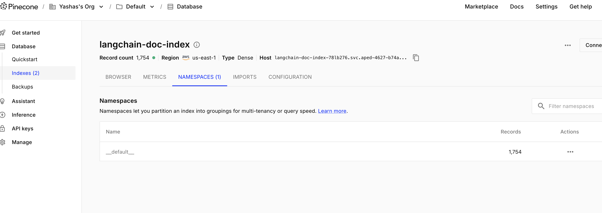
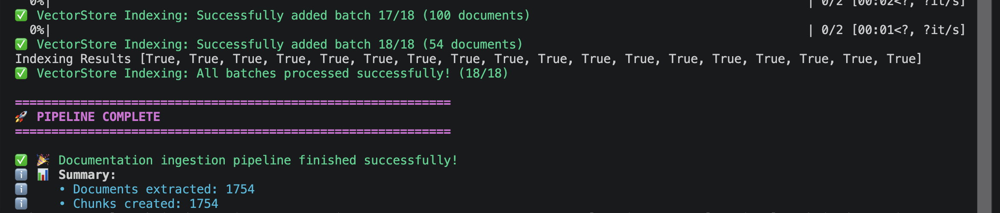
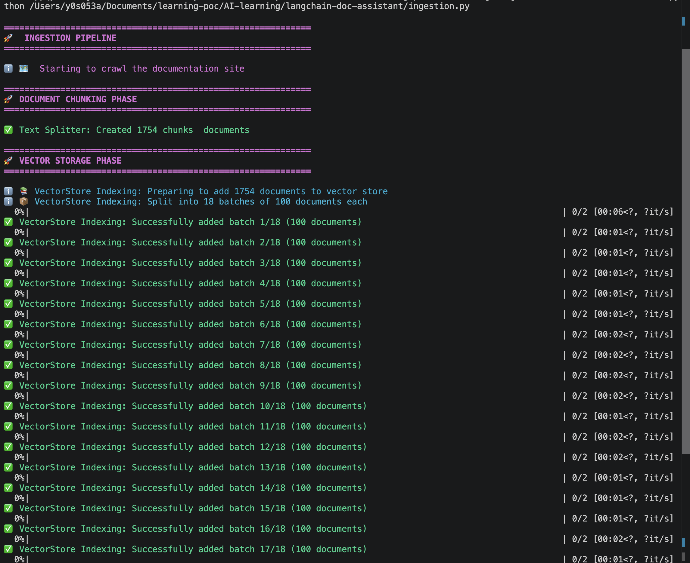
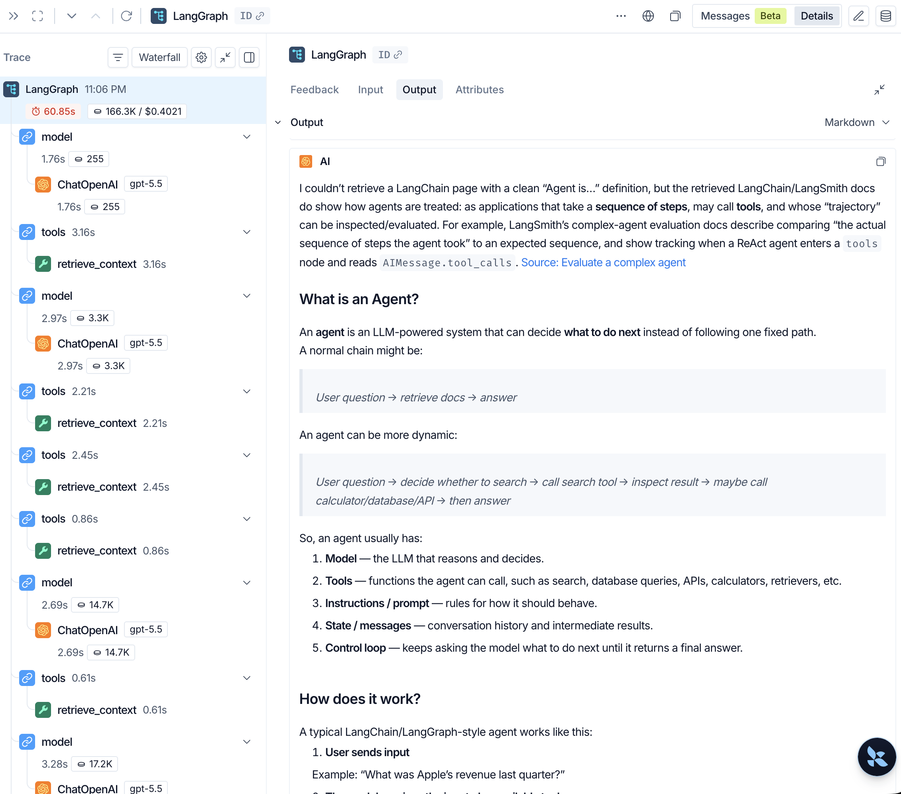
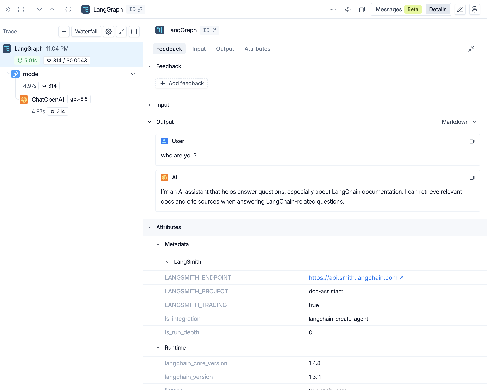
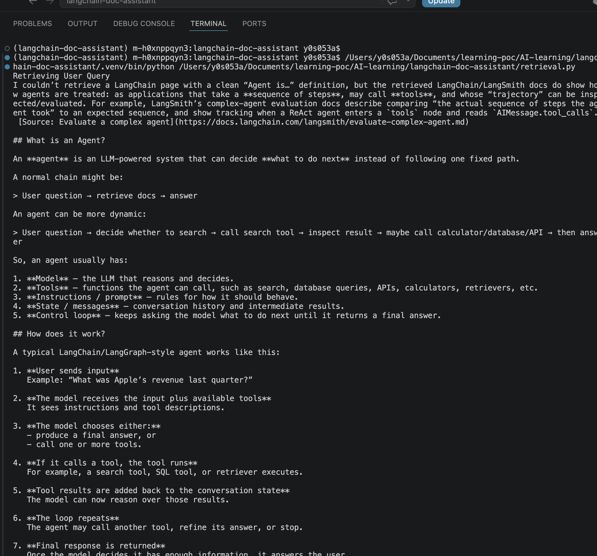
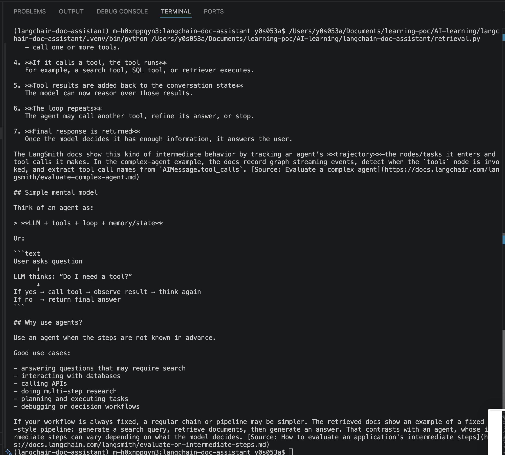

# LangChain Doc Assistant

A document assistant built using the LangChain framework.

## Setup

Install dependencies using uv:

```bash
uv add black isort langchain langchain-community langchain-core langchain-openai langchain-pinecone python-dotenv langchain_tavily
```

## Document Ingestion 
[ingestion.py]
Ingesting documantation from url -  https://docs.langchain.com/llms.txt
https://llmstxt.org/
https://www.gitbook.com/blog/what-is-llms-txt


Pinecone Ingested Vector Embeddings:



Execution logs 




## Query Retrieval

langSmith trace - https://smith.langchain.com/public/99c19863-a12d-48ea-ac93-36b9d83a9807/r/019f23e6-e762-7ca1-8946-8413e0952887



When a tool is not needed its not used by LLM


Logs



